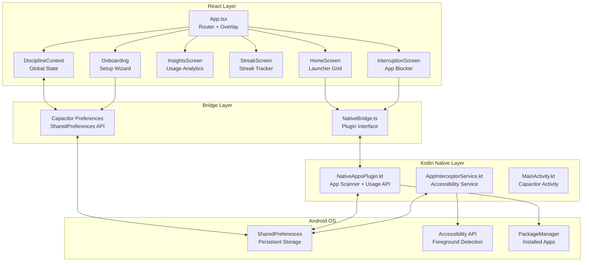
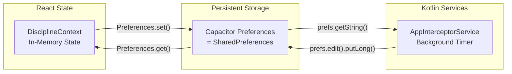
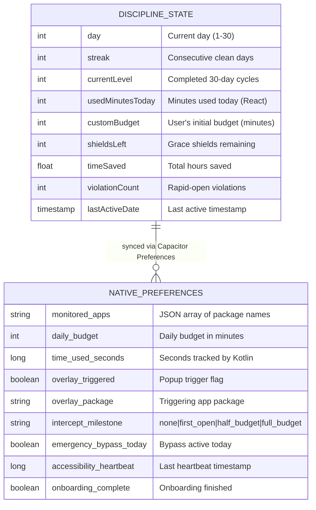
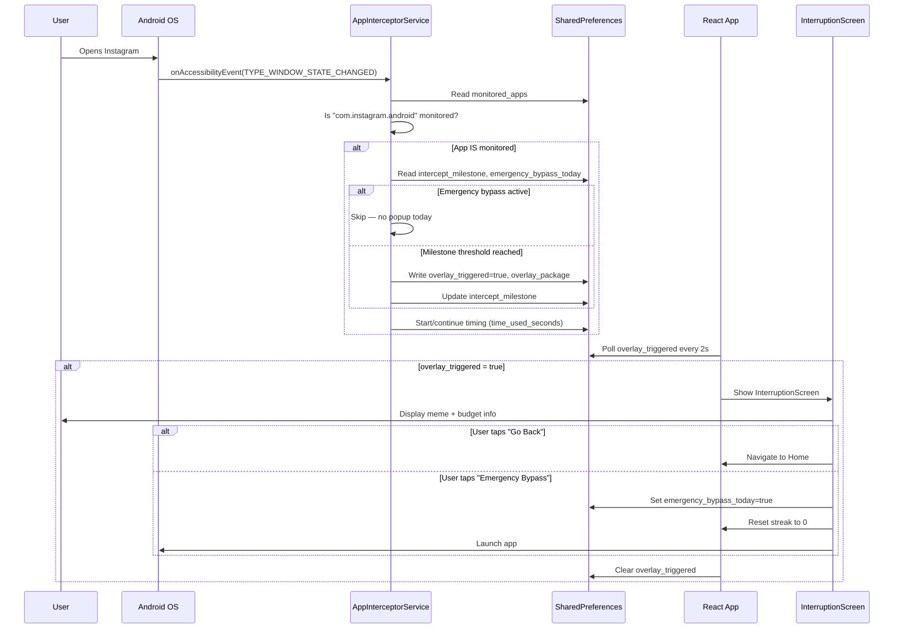
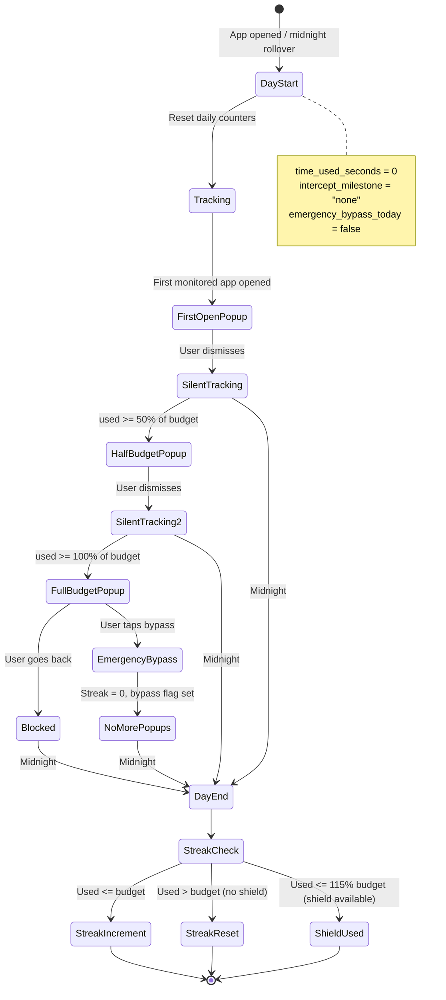
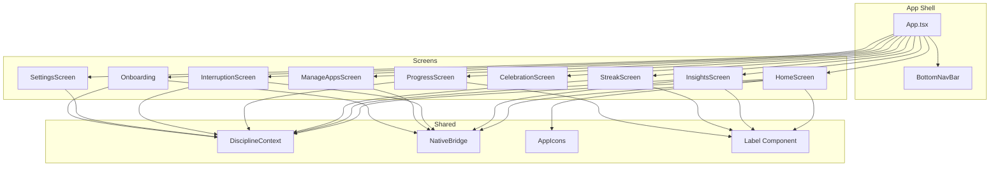

# Architecture

## System Overview

30 Days Discipline is a hybrid mobile app that combines a React TypeScript frontend with native Android Kotlin services, bridged by Capacitor 8.



---

## Data Architecture

### State Management



### SharedPreferences Schema (ER Diagram)



---

## Interception Flow



---

## Day Lifecycle



---

## Component Architecture



---

## Phase Budget Calculation

```
Phase 1 (Days 1–10):  budget = customBudget × 1.0
Phase 2 (Days 11–20): budget = customBudget × 0.7
Phase 3 (Days 21–30): budget = customBudget × 0.4

Level scaling (after completing a 30-day cycle):
  Level 1: multiplier × 1.0
  Level 2: multiplier × 0.85
  Level 3+: multiplier × 0.7
```

---

## Technology Decisions

| Decision | Rationale |
|----------|-----------|
| **Capacitor over React Native** | Simpler bridge to native, familiar web stack, direct SharedPreferences access |
| **Accessibility Service** | Only Android API that can detect foreground app without root |
| **SharedPreferences as IPC** | Both Kotlin service and React/Capacitor can read/write the same data store |
| **Milestone-based interception** | Constant popups annoy users; 3 strategic interruptions balance friction and usability |
| **Framer Motion** | Production-grade animations with React integration, tiny bundle impact |
| **DM Mono + Syne fonts** | Monospace for data, geometric sans for headers — premium feel |
