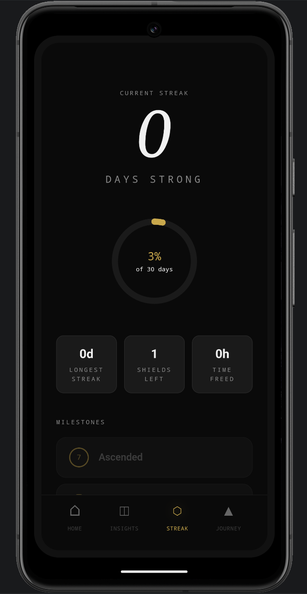
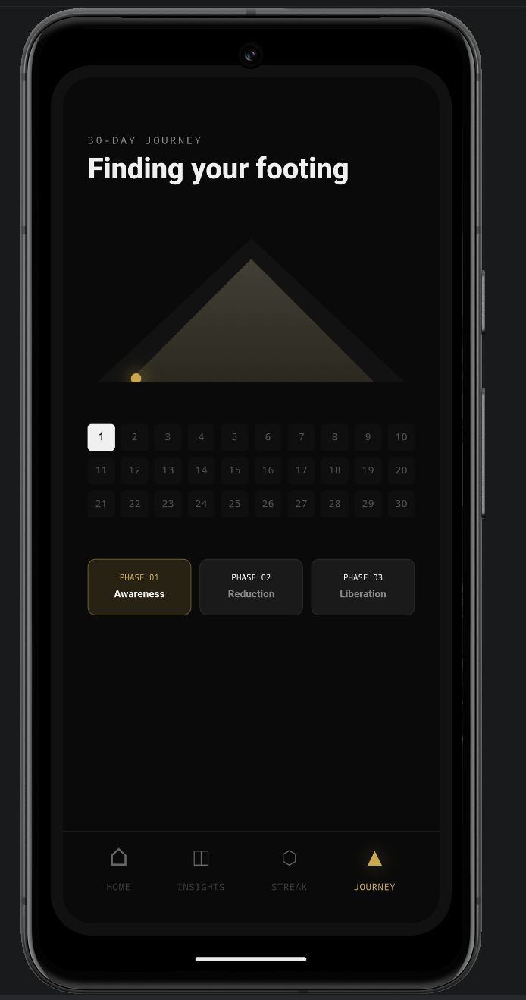
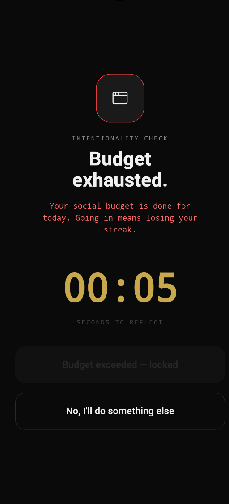
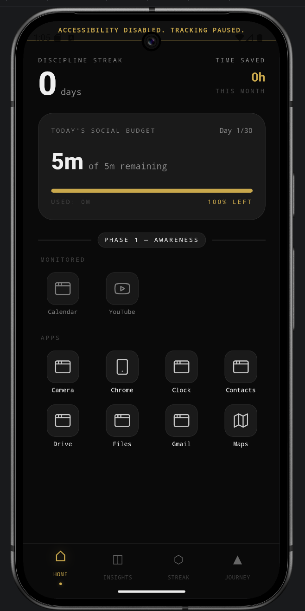
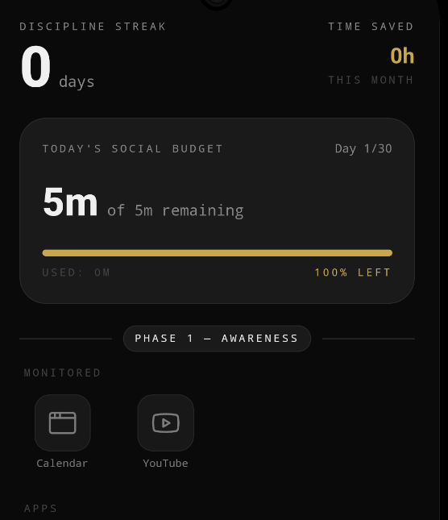

# 🔒 30 Days Discipline

**A premium Android launcher that helps you reclaim your time from social media — one day at a time.**

<p align="center">
  
  
  
  
  
</p>

---

## ✨ Features

### 🎯 Smart Interception
- **Milestone-based popups** — not every time you open an app, only at key moments:
  - First open of the day
  - 50% budget consumed
  - 100% budget exhausted
- **Emergency bypass** — access any app in emergencies, but your streak resets to zero
- **Savage memes** — random motivational/roast quotes on each interception

### 📊 Real-Time Tracking
- **Live usage timer** — Kotlin Accessibility Service tracks foreground time silently
- **Budget countdown** — see remaining time decrease in hours and minutes
- **Animated progress bar** — visual feedback with color-coded budget health

### 🔥 30-Day Journey
- **3 Phases** of increasing difficulty:
  - **Phase 1 (Days 1–10):** Awareness — full budget, learn your habits
  - **Phase 2 (Days 11–20):** Reduction — budget decreases by 30%
  - **Phase 3 (Days 21–30):** Liberation — budget decreases by 60%
- **Streak tracking** with milestone badges (7d, 14d, 21d, 30d)
- **Shield system** — 1 grace shield per 30-day cycle for minor overuse

### 🎨 Premium UI
- Dark mode with gold accents
- Framer Motion animations throughout:
  - Budget bar fill animation
  - Streak count-up with spring bounce
  - Staggered app grid entrance
  - Tap feedback with gold flash
  - Sliding gold dot on navigation
  - Phase badge with glow effects
- Custom typography (Syne, DM Mono, DM Serif Display)

### 📱 Social Media Filtering
- Onboarding prioritizes known social media apps (Instagram, YouTube, WhatsApp, Snapchat, TikTok, X, etc.)
- Users can also monitor ANY installed app
- 3×3 grid launcher layout

---

## 🏗️ Tech Stack

| Layer | Technology |
|-------|-----------|
| **Frontend** | React 18 + TypeScript |
| **Styling** | Tailwind CSS + Vanilla CSS |
| **Animations** | Framer Motion 11 |
| **Icons** | Lucide React |
| **Native Bridge** | Capacitor 8 |
| **Native Android** | Kotlin |
| **Background Service** | Android Accessibility Service |
| **Storage** | Capacitor Preferences (SharedPreferences) |
| **Build Tool** | Vite 5 |

---

## 📥 Installation

### Option 1: Download APK (Recommended)
1. Download the latest APK from [Releases](../../releases)
2. Transfer to your Android device
3. Enable "Install from unknown sources" in Settings
4. Install the APK
5. Open the app → Complete onboarding → Set your daily budget
6. Go to **Settings → Accessibility → Downloaded Apps → Discipline → Toggle ON**

### Option 2: Build from Source

#### Prerequisites
- Node.js 18+
- Android Studio (with Android SDK)
- A physical Android device (recommended) or emulator

#### Steps

```bash
# 1. Clone the repository
git clone https://github.com/Nasaniamoghvarsha/30days-dissocialize.git
cd 30days-dissocialize

# 2. Install dependencies
npm install

# 3. Build the web app
npm run build

# 4. Sync to Android
npx cap copy android

# 5. Open in Android Studio
npx cap open android
```

Then in Android Studio:
- Connect your device via USB
- Click **Run ▶** to install directly, OR
- Go to **Build → Build Bundle(s) / APK(s) → Build APK(s)** to generate an APK

---

## 🔧 Development

```bash
# Start dev server (browser preview)
npm run dev

# Build production
npm run build

# Sync to Android after changes
npx cap copy android

# Open Android Studio
npx cap open android
```

### Project Structure

```
30-days-discipline/
├── src/
│   ├── components/          # React UI screens
│   │   ├── HomeScreen.tsx       # Main launcher with app grid
│   │   ├── InsightsScreen.tsx   # Daily usage analytics
│   │   ├── StreakScreen.tsx     # Streak tracker + milestones
│   │   ├── ProgressScreen.tsx   # 30-day journey map
│   │   ├── InterruptionScreen.tsx # App interception overlay
│   │   ├── Onboarding.tsx       # First-time setup wizard
│   │   ├── SettingsScreen.tsx   # App settings
│   │   ├── ManageAppsScreen.tsx # Edit monitored apps
│   │   ├── CelebrationScreen.tsx # 30-day completion
│   │   └── Layout/
│   │       └── BottomNavBar.tsx  # Animated navigation bar
│   ├── context/
│   │   └── DisciplineContext.tsx # Global state management
│   ├── utils/
│   │   ├── NativeBridge.ts      # Kotlin ↔ React bridge
│   │   └── AppIcons.tsx         # App icon mapping
│   ├── App.tsx                  # Root component + routing
│   ├── main.tsx                 # Entry point
│   └── index.css                # Design tokens + animations
├── android/
│   └── app/src/main/java/com/thirtydays/discipline/
│       ├── MainActivity.kt          # Capacitor activity
│       ├── AppInterceptorService.kt # Accessibility service (time tracking)
│       └── NativeAppsPlugin.kt      # Native bridge plugin
├── capacitor.config.ts
├── package.json
├── vite.config.ts
└── tsconfig.json
```

---

## ⚙️ How It Works

### Time Tracking Flow
1. User opens a monitored app (e.g., Instagram)
2. Android's Accessibility Service detects the foreground app change
3. `AppInterceptorService.kt` checks if the app is in the monitored list
4. Timer starts/stops silently in SharedPreferences
5. At milestone thresholds, an overlay trigger is written
6. React polls for overlay triggers and shows `InterruptionScreen`

### Data Flow
```
React Context (DisciplineContext)
    ↕ Capacitor Preferences API
SharedPreferences (Android)
    ↕ Direct read/write
AppInterceptorService (Kotlin Accessibility Service)
```

### Day Rollover
At midnight (or when the app detects a new day):
- `time_used_seconds` resets to 0
- `intercept_milestone` resets to `none`
- `emergency_bypass_today` resets to `false`
- Streak incremented (if within budget) or reset (if over)

---

## 🤝 Contributing

See [CONTRIBUTING.md](CONTRIBUTING.md) for guidelines.

## 📄 License

This project is licensed under the MIT License — see [LICENSE](LICENSE) for details.

## 📋 Changelog

See [CHANGELOG.md](CHANGELOG.md) for version history.

---

<p align="center">
  <strong>Built with discipline, for discipline.</strong><br/>
  <em>Put the phone down. Focus.</em>
</p>
